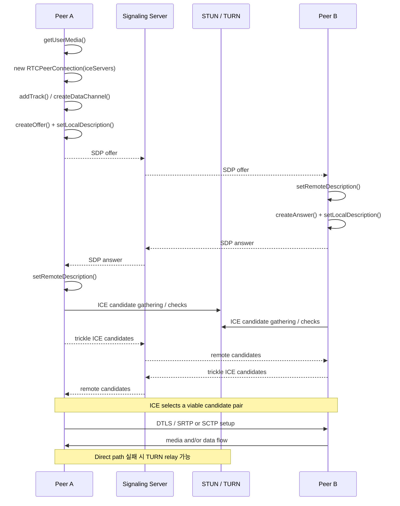
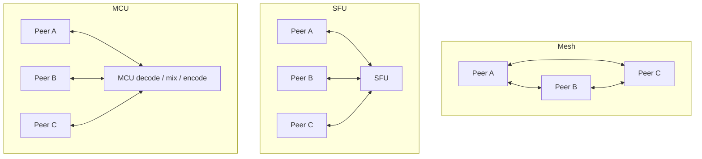

# WebRTC 핵심 Web API 심층 조사 보고서

작성 날짜: 2026. 10. 07.

## 실행 요약

본 문서는 `webrtc.github.io/samples`가 실제로 시연하는 API와 그 주변 기술을 재분류하고, 현재 W3C 사양, MDN Browser Compatibility Data, Can I Use의 2026년 데이터, Chrome/WebKit/Android 공식 자료를 교차 확인한 결과이다. 샘플 사이트 자체는 `getUserMedia`, `MediaStream` 캡처·처리, `RTCPeerConnection`, `RTCDataChannel`, ICE/STUN/TURN, Web Audio 연계, WebRTC Encoded Transform/Insertable Streams 등을 직접 시연한다. 현재 샘플의 E2EE 구현은 표준 `RTCRtpScriptTransform`을 우선 사용하면서 구형 Chromium의 `createEncodedStreams()`를 fallback으로 남겨 두고 있다.

**프로덕션의 안정적인 공통 기반은 `getUserMedia` → `MediaStream`/`MediaStreamTrack` → `RTCPeerConnection` → `RTCRtpSender`/`RTCRtpReceiver`이며, 데이터가 필요하면 `RTCDataChannel`을 추가하는 구조이다.** 이 계층은 Chrome·Firefox·Safari에서 수년 전부터 폭넓게 지원되며, 최신 호환성 자료에서 핵심 인터페이스 자체의 지원 문제가 실질적인 장애가 되는 경우는 드물다. 반면 세부 RTP parameter, codec capability, raw-frame processing, encoded transform 같은 하위 기능은 인터페이스 지원 시점과 별개로 브라우저별 지원 시점이 크게 다르므로 반드시 개별 feature detection이 필요하다.

**E2EE나 encoded-frame 조작의 신규 구현은 `RTCRtpScriptTransform`을 기준으로 해야 한다.** MDN은 이를 2025년 10월부터 최신 주요 브라우저에서 공통 사용 가능한 Baseline 2025 기능으로 분류한다. 현재 BCD의 인터페이스 최소 지원점은 Chrome 141, Firefox 117, Safari 15.4이다. 반대로 과거 “WebRTC Insertable Streams”라는 이름으로 널리 알려진 `RTCRtpSender.createEncodedStreams()`와 `RTCRtpReceiver.createEncodedStreams()`는 비표준 Chromium API이며 Firefox와 Safari가 지원하지 않는다.

**`WebCodecs`는 WebRTC를 대체하지 않고 전후단의 media processing을 보강한다.** `VideoFrame`, `VideoEncoder`/`VideoDecoder`, `AudioData`, `AudioEncoder`/`AudioDecoder` 등을 통해 codec을 직접 제어하지만 네트워크 전송, ICE, RTP, signaling 기능은 제공하지 않는다. WebRTC samples의 raw-frame processing 예제도 WebCodecs를 선택적 transform으로 사용한다. Chrome/Edge 94+, Firefox 130+ desktop, Safari 16.4+에서 시작하지만 Safari는 26 계열 이전을 부분 지원으로 분류하고 Firefox Android는 현재 WebCodecs를 지원하지 않으므로 기본 WebRTC 경로보다 호환성 관리가 까다롭다.

**`WebTransport`는 WebRTC의 일부도, P2P API도 아니다.** HTTP/3 서버와 reliable stream 및 unreliable datagram을 교환하는 client-server transport이므로 게임 상태 동기화, 실시간 telemetry, collaboration backend와 같은 용도에는 적합하지만 `RTCPeerConnection`의 직접적인 대체물이 아니다. 현재 WebRTC samples 인덱스에도 WebTransport 예제는 없다. 2026년에는 Chrome 97+, Edge 98+, Firefox 114+, Safari/iOS Safari 26.4+까지 지원 범위가 넓어져 주변 기술로 검토할 가치는 커졌다.

**PWA 설치는 WebRTC에 네이티브 앱 수준의 background privilege를 부여하지 않는다.** `RTCPeerConnection`은 현행 WebRTC 사양에서 `Window`에 노출되므로 Service Worker가 peer connection을 소유할 수 없고, Service Worker 자체도 DOM이 없는 event-driven worker이다. 미디어 캡처 사양은 문서가 화면에 보이지 않을 때 장치 재획득을 지연하고 track을 mute할 수 있도록 규정한다. 따라서 잠금 화면·앱 전환·OS resource pressure를 거치면서 카메라·마이크·WebRTC 세션이 계속 유지된다고 설계해서는 안 된다.

- **일대일 통화는 브라우저 간 P2P와 TURN fallback, 일반적인 다자간 회의는 SFU를 기본 아키텍처로 선택하는 것이 타당하다. MCU는 server-side mixing·transcoding이 반드시 필요한 경우로 제한하는 것이 좋다.** [추론]  
  WebRTC는 signaling 방식을 정의하지 않으며 ICE는 STUN/TURN과 함께 동작한다. 직접 socket 경로가 항상 가능한 것이 아니므로 Google의 WebRTC 공식 문서도 대부분의 실제 앱에 TURN relay가 필요하다고 설명한다. Mesh에서는 참가자가 늘어날 때 각 클라이언트의 송신 경로와 연결 수가 함께 증가하는 반면 SFU는 송신을 서버 집중형으로 바꿀 수 있다. 따라서 모바일 CPU·uplink·배터리까지 고려하면 일반적인 다자간 회의에서 mesh의 비용 증가가 가장 먼저 문제가 된다.

## 조사 범위와 API 지도

WebRTC samples의 현재 인덱스는 크게 **media capture**, **device enumeration**, **stream capture**, **peer connection**, **data channel**, **insertable streams** 예제로 구성되어 있다. Peer connection 영역에는 기본 통화뿐 아니라 perfect negotiation, bitrate 및 codec 설정, ICE candidate·STUN/TURN·ICE restart, 상태 감시, DTMF, RTP statistics, SVC 등이 포함된다. Insertable Streams 영역에는 E2EE, encoded-frame analyzer, video/audio processing, crop worker, WebGPU 예제가 있다.

API 계층을 구현 관점에서 정리하면 다음과 같다.

```text
Camera / Microphone / Screen
          │
          ▼
 getUserMedia / getDisplayMedia
          │
          ▼
      MediaStream
          │
          └──── MediaStreamTrack
                    │
            ┌───────┴────────┐
            ▼                ▼
   raw-frame processing   RTCPeerConnection
   TrackProcessor             │
   WebCodecs                  ├─ RTCRtpSender
                              │    └─ Encoded Transform
                              │
                              ├─ RTCRtpReceiver
                              │    └─ Encoded Transform
                              │
                              └─ RTCDataChannel
                                   SCTP / DTLS

Adjacent, not WebRTC:
Client ───── WebTransport ───── HTTP/3 Server
```

`MediaStream`과 `MediaStreamTrack`은 media representation 계층이고, `RTCPeerConnection`은 연결·ICE·RTP/SCTP 협상을 조정한다. `RTCRtpSender`와 `RTCRtpReceiver`가 실제 outgoing/incoming RTP media의 제어점을 제공한다. WebCodecs는 codec 제어 계층이며 WebTransport는 별도의 서버 transport 계층이다.

여기서 “Insertable Streams”라는 표현은 2026년 기준 세 가지를 구분해서 사용해야 한다.

| 용어                                 | 의미                                                                                                           | 현재 판단                                                                            |
| ------------------------------------ | -------------------------------------------------------------------------------------------------------------- | ------------------------------------------------------------------------------------ |
| **WebRTC Encoded Transform**         | codec 이후·RTP packetization 전후의 encoded frame을 `RTCRtpScriptTransform`으로 Worker에서 변환한다.           | 신규 구현의 기준이다.                                                                |
| **Legacy WebRTC Insertable Streams** | `sender.createEncodedStreams()` / `receiver.createEncodedStreams()`를 사용하는 Chromium의 구형 비표준 API이다. | 신규 의존을 피하고 기존 Chromium fallback으로만 취급하는 편이 안전하다.              |
| **MediaStream raw-frame transform**  | `MediaStreamTrackProcessor`로 `VideoFrame`을 꺼내고 generator를 통해 새 track을 만든다.                        | 배경 제거·crop·AI processing에 유용하지만 브라우저 간 API 형태가 아직 균일하지 않다. |

## 핵심 API 분석

| API                                                       | 기술적 역할과 일반 패턴                                                                                                                                                                                                                   | 주요 메서드·객체·이벤트                                                                                                                                                                                                                                                                                                                                       | 구체적 사례와 핵심 제약                                                                                                                                                                                                                                  |
| --------------------------------------------------------- | ----------------------------------------------------------------------------------------------------------------------------------------------------------------------------------------------------------------------------------------- | ------------------------------------------------------------------------------------------------------------------------------------------------------------------------------------------------------------------------------------------------------------------------------------------------------------------------------------------------------------- | -------------------------------------------------------------------------------------------------------------------------------------------------------------------------------------------------------------------------------------------------------- |
| **`MediaDevices.getUserMedia()`**                         | 카메라·마이크 제약 조건을 받아 `Promise<MediaStream>`을 반환하는 capture 진입점이다. 일반 흐름은 사용자 동작 → constraints 구성 → `getUserMedia()` → local `<video>.srcObject` → track을 peer connection 또는 recorder에 전달하는 것이다. | `navigator.mediaDevices.getUserMedia()`, `MediaTrackConstraints`, `MediaStream`; 오류는 `NotAllowedError`, `NotFoundError`, `OverconstrainedError` 등이 중요하다. 사용자가 permission prompt를 무시하면 Promise가 resolve/reject되지 않은 채 남을 수도 있다.                                                                                                  | 화상회의, 음성통화, QR/barcode camera, 녹화, 음성입력이다. HTTPS secure context가 필요하고 permission이 필요하다. cross-origin iframe은 `Permissions-Policy`와 `allow="camera; microphone"` 설정이 없으면 접근할 수 없다.                                |
| **`MediaStream`**                                         | 여러 audio/video `MediaStreamTrack`을 논리적으로 묶는 컨테이너이다. 네트워크 transport가 아니며 `getUserMedia()`, `getDisplayMedia()`, canvas/media element capture 또는 직접 constructor로 얻을 수 있다.                                 | `getTracks()`, `getAudioTracks()`, `getVideoTracks()`, `getTrackById()`, `addTrack()`, `removeTrack()`, `clone()`, `active`; `addtrack`, `removetrack` 이벤트가 있다.                                                                                                                                                                                         | local preview, recording 입력, 여러 track의 논리적 grouping, canvas/output composition에 사용한다. `MediaStream`에서 track을 제거하는 것과 실제 capture source를 `track.stop()`으로 종료하는 것은 별개 개념이다.                                         |
| **`MediaStreamTrack`**                                    | 하나의 audio 또는 video media source를 나타내는 최소 단위이다. 캡처 해상도·FPS·AEC 같은 제약과 현재 settings가 track 단위로 관리된다.                                                                                                     | `applyConstraints()`, `getConstraints()`, `getSettings()`, `getCapabilities()`, `clone()`, `stop()`, `enabled`, `muted`, `readyState`, `contentHint`; `mute`, `unmute`, `ended` 이벤트가 중요하다.                                                                                                                                                            | 카메라 품질 조절, 일시 mute, adaptive capture, 처리 파이프라인의 입력이다. `enabled=false`는 의도적인 mute 용도이며 source 종료와 같지 않다. 배경 상태에서는 UA가 track을 mute하거나 장치 재획득을 지연할 수 있다.                                       |
| **`RTCPeerConnection`**                                   | local endpoint와 remote endpoint 사이 WebRTC 연결을 생성·협상·감시한다. SDP offer/answer, ICE candidate, RTP media, SCTP data channel과 DTLS transport를 조정하는 중심 객체이다.                                                          | `createOffer()`, `createAnswer()`, `setLocalDescription()`, `setRemoteDescription()`, `addIceCandidate()`, `addTrack()`, `removeTrack()`, `addTransceiver()`, `createDataChannel()`, `getStats()`, `restartIce()`, `close()`; `negotiationneeded`, `icecandidate`, `track`, `datachannel`, `connectionstatechange`, `iceconnectionstatechange` 등이 중요하다. | 1:1 통화, 화면공유, SFU 연결, media gateway 연결에 사용한다. signaling protocol은 WebRTC가 정의하지 않으므로 WebSocket·HTTP 등의 별도 signaling layer가 필요하다.                                                                                        |
| **`RTCDataChannel`**                                      | `RTCPeerConnection`에 종속된 양방향 임의 데이터 채널이다. WebRTC data channel은 SCTP/DTLS 계층을 이용하며 reliable/ordered 동작 외에도 제한적 재전송 등 low-latency 정책을 선택할 수 있다.                                                | `send()`, `close()`, `bufferedAmount`, `bufferedAmountLowThreshold`, `readyState`, `ordered`, `maxRetransmits`, `maxPacketLifeTime`, `negotiated`; `open`, `message`, `bufferedamountlow`, `error`, `closing`, `close` 이벤트가 핵심이다.                                                                                                                     | collaborative cursor, whiteboard, game state, P2P chat, file transfer에 적합하다. 대용량 전송에서는 `bufferedAmount`를 무시한 연속 `send()` 대신 backpressure를 구현해야 한다.                                                                           |
| **`RTCRtpSender`**                                        | 하나의 outgoing track을 RTP로 인코딩·전송하는 제어점이다. `RTCPeerConnection.addTrack()` 또는 transceiver에서 얻어 codec·encoding·bitrate·track 교체를 제어한다.                                                                          | `track`, `replaceTrack()`, `getParameters()`, `setParameters()`, `getStats()`, `getCapabilities()`, `transform`; `replaceTrack()`은 가능한 경우 renegotiation 없이 source track을 교체한다.                                                                                                                                                                   | front/rear camera 전환, screen-share source 교체, bitrate·simulcast layer 제어, outbound QoE 관측, E2EE transform 연결에 사용한다. 세부 `RTCRtpEncodingParameters` 지원은 브라우저별 차이가 있으므로 인터페이스 지원 여부만으로 기능을 판단하면 안 된다. |
| **`RTCRtpReceiver`**                                      | remote RTP stream을 받아 해당 `MediaStreamTrack`으로 노출하고 inbound statistics·codec 상태·encoded transform의 진입점을 제공한다.                                                                                                        | `track`, `getParameters()`, `getStats()`, `getCapabilities()`, `getSynchronizationSources()`, `getContributingSources()`, `transform`.                                                                                                                                                                                                                        | remote track rendering, packet loss·jitter·inbound bitrate 관측, active speaker 관련 SSRC 분석, receiver-side E2EE 복호화에 사용할 수 있다.                                                                                                              |
| **`RTCRtpScriptTransform` / WebRTC Encoded Transform**    | encoder 출력 이후 또는 decoder 입력 이전의 encoded audio/video frame에 Worker 기반 `TransformStream`을 삽입하는 표준 API이다. sender/receiver의 `transform`에 연결한다.                                                                   | `new RTCRtpScriptTransform(worker, options)`, Worker의 `rtctransform` event, `RTCRtpScriptTransformer.readable`, `.writable`, encoded audio/video frame 객체가 중심이다.                                                                                                                                                                                      | SFU를 통과하는 application-level E2EE, encoded-frame metadata, 분석·watermark 같은 기능에 적합하다. 현재 samples의 E2EE 예제도 이 API를 우선한다.                                                                                                        |
| **Legacy WebRTC Insertable Streams**                      | `RTCRtpSender/Receiver.createEncodedStreams()`가 `ReadableStream`/`WritableStream`을 직접 노출하던 Chromium 전용 실험 API이다. 현재 표준 경로는 `RTCRtpScriptTransform`이다.                                                              | `createEncodedStreams()`와 transferable streams가 핵심이다. 현재 WebRTC sample은 `RTCRtpScriptTransform`이 없을 때만 이 경로를 fallback으로 사용한다.                                                                                                                                                                                                         | 기존 Chrome 기반 E2EE 구현 유지보수에는 필요할 수 있으나 신규 cross-browser 제품의 public contract로 삼는 것은 적절하지 않다. Firefox·Safari는 해당 구형 메서드를 지원하지 않는다.                                                                       |
| **`MediaStreamTrackProcessor` 계열 raw-frame processing** | media track을 raw `VideoFrame` stream으로 풀어 custom transform 후 다시 track으로 만드는 계층이다. WebRTC samples는 processor/generator와 Worker, `TransformStream`, WebCodecs/WebGPU 조합을 시연한다.                                    | `MediaStreamTrackProcessor({track})`, `.readable`, `TransformStream`; 표준화 과정에서 `VideoTrackGenerator`와 기존 Chromium `MediaStreamTrackGenerator` 사이 차이가 있어 구현 세부를 feature-detect해야 한다.                                                                                                                                                 | virtual background, crop, ML inference, blur, frame annotation이 대표적이다. 이 영역은 기본 WebRTC API보다 호환성 불일치가 크다.                                                                                                                         |
| **WebCodecs**                                             | 브라우저 내부 codec 구현을 JavaScript에서 직접 제어하도록 raw/encoded audio·video 타입과 encoder/decoder를 제공한다. 특정 codec 지원 자체는 WebCodecs 사양이 보장하지 않는다.                                                             | `VideoFrame`, `AudioData`, `EncodedVideoChunk`, `EncodedAudioChunk`, `VideoEncoder`, `VideoDecoder`, `AudioEncoder`, `AudioDecoder`; `configure()`, `encode()`/`decode()`, `flush()`, `reset()`, `close()`, `isConfigSupported()`가 중심이다.                                                                                                                 | custom recording, transcoding, editor, WebRTC 전후 custom processing, worker pipeline에 적합하다. WebRTC samples에서도 raw frames를 WebCodec transform에 통과시키는 옵션이 있다.                                                                         |
| **WebTransport**                                          | HTTP/3 서버에 연결하여 reliable unidirectional/bidirectional stream과 unreliable datagram을 제공하는 low-latency client-server API이다. WebRTC P2P transport가 아니다.                                                                    | `new WebTransport(url)`, `ready`, `closed`, `close()`, `datagrams`, bidirectional/unidirectional stream creation·incoming streams, congestion-control 관련 옵션이 있다.                                                                                                                                                                                       | multiplayer backend, real-time collaboration server, telemetry, media-adjacent custom protocol에는 유용하다. 직접 peer discovery·ICE·RTP·camera capture 기능은 제공하지 않는다.                                                                          |

WebRTC codec 상호운용성에서 가장 안전한 baseline은 규격상 **video VP8와 H.264 Constrained Baseline, audio Opus와 G.711 PCMA/PCMU**이다. 최신 MDN codec 가이드는 추가로 VP9, AV1, HEVC 등이 특정 브라우저·버전에서 제공되지만 cross-platform 보장은 별개라고 명시한다. 실제 codec 선택은 SDP negotiation 결과와 `RTCRtpSender/Receiver.getCapabilities()`를 기준으로 해야 한다.

Echo cancellation도 별도의 “WebRTC on/off” 기능으로 취급하면 안 된다. capture constraints의 `echoCancellation`, `noiseSuppression`, `autoGainControl` 등의 실제 지원 범위가 다르고, WebRTC audio baseline 자체에도 echo-cancellation 관련 요구·권고가 포함된다. Safari 26.4는 macOS에서 여러 microphone의 동시 `getUserMedia` capture와 echo-cancellation processing 관리를 개선했다.

- **음성회의 기본값과 음악·악기 입력의 capture preset을 분리하는 편이 안전하다.** [추론]  
  WebRTC voice stack은 echo cancellation과 noise/level processing을 고려해 설계되어 있으나 music source에서는 같은 처리가 신호를 훼손할 수 있다. 따라서 앱은 `getSupportedConstraints()`·track capabilities/settings를 확인하여 speech preset과 music preset을 분리하고, 지원하지 않는 constraint는 강제하지 않는 구조가 안정적이다.

## 호환성 분석

다음 표의 버전은 **인터페이스 또는 핵심 API가 최초 지원된 버전**을 우선 기재한 것이다. 세부 member의 최초 버전은 더 늦을 수 있다. 예를 들어 `RTCRtpSender` 자체는 오래전부터 지원되어도 `getCapabilities()`, `setParameters()`, Encoded Transform 같은 member는 별도의 지원 시점이 존재한다. 최신 MDN BCD main branch와 2026년 9월 Can I Use 데이터를 기준으로 대조했다.

`mirror`로 관리되는 BCD 항목이나 iOS의 제3자 브라우저처럼 정확한 독립 최소 버전이 공개 compatibility dataset에 없는 경우에는 임의 숫자를 만들지 않고 “engine 의존” 또는 “별도 최소치 없음”으로 표시했다.

| API                             |                                    Chrome |                              Edge |                              Firefox |                         Safari |                                    Android WebView |                     iOS Safari | Chrome on iOS                                                       | Desktop vs Mobile                                                                       | OS 지원 요약                                                               |
| ------------------------------- | ----------------------------------------: | --------------------------------: | -----------------------------------: | -----------------------------: | -------------------------------------------------: | -----------------------------: | ------------------------------------------------------------------- | --------------------------------------------------------------------------------------- | -------------------------------------------------------------------------- |
| `getUserMedia`                  |                                   **53+** |                           **12+** |                              **36+** |                        **11+** |                                            **53+** |                        **11+** | 독립 Blink 버전으로 판단 불가. iOS engine/OS feature detection 필요 | desktop·mobile 모두 안정적. mobile permission/background 정책 차이가 더 큼              | Windows/macOS/Linux/ChromeOS/Android 및 Safari가 제공되는 macOS/iOS/iPadOS |
| `MediaStream`                   | **55+** 표준 이름, 과거 WebKit prefix 21+ |                           **12+** |                              **15+** |                        **11+** |                                BCD Chromium mirror |                        **11+** | engine 의존                                                         | 핵심 track grouping은 양쪽 모두 광범위                                                  | browser가 지원하는 주요 desktop/mobile OS                                  |
| `MediaStreamTrack`              |                                   **26+** |                           **12+** |                              **22+** |                        **11+** |                                    Chromium mirror |                        **11+** | engine 의존                                                         | 기본 API는 폭넓으나 constraint별 차이가 있음                                            | 주요 desktop OS, Android, Apple OS                                         |
| `RTCPeerConnection`             |      **56+ 표준 이름**, 과거 prefixed 23+ |                           **15+** | **44+ 표준 이름**, 과거 prefixed 22+ |                        **11+** |                                    Chromium mirror |                        **11+** | engine 의존                                                         | 기본 연결은 desktop/mobile 공통. mobile lifecycle가 주요 차이                           | Windows/macOS/Linux/ChromeOS/Android/macOS/iOS                             |
| `RTCDataChannel`                |                                   **24+** | **79+**. Legacy Edge 12–18 미지원 |                              **22+** |                        **11+** |                                    Chromium mirror |                        **11+** | engine 의존                                                         | 기본 channel은 양쪽 모두 안정적                                                         | 주요 desktop/mobile OS                                                     |
| `RTCRtpSender`                  |                                   **64+** |                           **13+** |                              **34+** |                        **11+** |                                    Chromium mirror |                  Safari mirror | engine 의존                                                         | 기본 sender는 공통. parameter·codec·transform member별 버전 차이 큼                     | 주요 desktop/mobile OS                                                     |
| `RTCRtpReceiver`                |                                   **59+** |                           **12+** |                              **34+** |                        **11+** |                                    Chromium mirror |                  Safari mirror | engine 의존                                                         | 기본 receiver는 공통. `getCapabilities()` 등은 더 늦음                                  | 주요 desktop/mobile OS                                                     |
| `RTCRtpScriptTransform`         |                                  **141+** |          Chromium 141 계열 mirror |                             **117+** |                      **15.4+** |                                    Chromium mirror |                      **15.4+** | iOS engine 의존                                                     | 2025년 말부터 최신 browser 공통 baseline이 되었지만 구형 mobile fleet에는 fallback 필요 | 지원 브라우저가 동작하는 desktop/mobile OS                                 |
| Legacy `createEncodedStreams()` |                           **86+**, 비표준 |         Chromium 계열 구현만 고려 |                           **미지원** |                     **미지원** |                                      Chromium 계열 |                     **미지원** | WebKit 경로 미지원                                                  | 사실상 Chromium legacy API                                                              | Chromium 지원 OS에 한정                                                    |
| `MediaStreamTrackProcessor`     |                         **94+ 부분 지원** |                 **94+ 부분 지원** |                           **미지원** |                        **18+** |                            Chromium 계열 부분 지원 |                        **18+** | iOS engine 의존                                                     | raw-frame pipeline의 cross-browser parity가 낮음                                        | Chromium·Safari 지원 OS. Firefox는 현재 핵심 제약                          |
| WebCodecs                       |                                   **94+** |                           **94+** |                     **130+ desktop** | **16.4+ 부분**, **26.0+ full** |                                   Chromium 94 계열 | **16.4+ 부분**, **26.0+ full** | WebKit capability 기준으로 feature-detect                           | Chrome Android 지원, **Firefox Android는 현재 미지원**                                  | desktop 광범위, Android Chromium, Apple OS                                 |
| WebTransport                    |                                   **97+** |                           **98+** |                             **114+** |                      **26.4+** | 최신 Chromium WebView는 별도 최소치 자료 확인 필요 |                      **26.4+** | iOS engine/배포 형태에 따라 feature-detect                          | 2026년에 Apple mobile까지 확대되었으나 구형 iOS에서 사용할 수 없음                      | 주요 desktop OS·Android 및 Safari 26.4+ Apple OS                           |

특히 **Edge의 `RTCDataChannel`은 다른 WebRTC core API와 역사가 다르다.** Legacy Edge 12~18은 peer connection 일부를 지원했지만 RTCDataChannel은 지원하지 않았고, Chromium 기반 Edge 79부터 현재의 cross-browser 호환 범위에 들어간다. 따라서 “Edge 15부터 WebRTC 지원”을 곧바로 “DataChannel도 Edge 15부터 지원”으로 해석하면 오류가 된다.

**Chrome on iOS는 desktop Chrome의 버전 번호로 호환성을 추정해서는 안 된다.** Apple은 iOS/iPadOS에서 entitlement를 받은 alternative browser engine을 일부 지역·조건에서 허용하고 있으므로 2026년에는 “모든 iOS 브라우저가 언제나 동일 WebKit”이라고 일반화하는 것 또한 정확하지 않다. 반대로 MDN BCD는 Chrome iOS를 desktop Chrome/Blink의 별도 compatibility row로 제공하지 않는다. 따라서 배포 대상 iOS에서는 `navigator.mediaDevices`, `RTCPeerConnection`, `RTCRtpScriptTransform`, `VideoEncoder`, `WebTransport`를 런타임 feature detection하는 방식이 가장 안전하다.

- **호환성 정책은 “브라우저 이름/버전 allowlist”보다 capability-based gating으로 구성해야 한다.** [추론]  
  기본 WebRTC 인터페이스는 이미 폭넓게 지원되지만 RTP subfeature, raw-frame processing, WebCodecs, Encoded Transform의 도입 버전이 각각 다르며 iOS의 engine 선택도 단순한 Chrome 버전과 일치하지 않는다. 따라서 `typeof RTCRtpScriptTransform`, `RTCRtpSender.getCapabilities`, `VideoEncoder.isConfigSupported`, `'WebTransport' in globalThis` 같은 실제 capability 검사가 버전 문자열 판단보다 오류 가능성이 낮다.

## PWA 적용성

**PWA에서 WebRTC를 사용할 수 있지만 “PWA이기 때문에” 카메라·마이크·background WebRTC 권한이 추가되는 것은 아니다.** capture는 여전히 secure context와 사용자 permission에 종속된다. `RTCPeerConnection`은 현재 W3C WebIDL에서 `[Exposed=Window]`이므로 Service Worker 내부에서 peer connection을 생성하여 통화를 계속 유지하는 패턴은 표준 API 모델과 맞지 않는다.

Service Worker는 offline cache, request interception, push·sync 같은 event-driven 작업에 사용해야 한다. MDN은 Service Worker가 worker context에서 동작하고 DOM에 접근하지 못한다고 명시한다. 따라서 Service Worker는 signaling notification을 받아 사용자에게 재진입을 유도하거나 정적 자산을 관리할 수 있지만, background RTC media engine으로 사용해서는 안 된다.

흥미롭게도 최신 WebRTC 사양의 `RTCDataChannel` 자체는 `Window`와 `DedicatedWorker`에 노출되고 transferable이지만, `RTCPeerConnection`은 여전히 `Window`에 노출된다. 여기서의 Worker는 **DedicatedWorker이지 ServiceWorker가 아니다.** DataChannel processing 일부를 worker로 옮길 수 있다는 것과 PWA background service worker가 WebRTC 연결을 소유할 수 있다는 것은 다른 문제이다.

### PWA 상태별 판단

| 환경                           | 현재 판단                                                                                                                                                                                                                                | 구현상 의미                                                                                                                                   |
| ------------------------------ | ---------------------------------------------------------------------------------------------------------------------------------------------------------------------------------------------------------------------------------------- | --------------------------------------------------------------------------------------------------------------------------------------------- |
| 일반 desktop PWA               | 설치된 window에서 WebRTC core API를 사용할 수 있다. API permission/lifecycle 모델은 web origin을 따른다.                                                                                                                                 | 설치 여부를 별도 capability로 취급하지 말고 browser API를 검사한다.                                                                           |
| Android Chrome PWA             | 일반 Chrome web app과 같은 capture/WebRTC 계층 위에서 동작한다. background 상태에서 page lifecycle과 OS resource management 영향을 받는다.                                                                                               | foreground 통화 중심으로 설계하고 background 복귀 시 connection/track 상태를 재검증한다.                                                      |
| Android WebView                | JS API 지원과 별개로 host app이 WebView permission 요청을 처리해야 한다. Android의 `PermissionRequest`는 video/audio capture resource를 `WebChromeClient.onPermissionRequest()`로 전달한다.                                              | Android runtime CAMERA/RECORD_AUDIO permission과 WebView origin permission을 둘 다 설계해야 한다.                                             |
| iOS/iPadOS Home Screen web app | `getUserMedia` 지원 자체는 과거 iOS 13.4에서 Home Screen app에 추가되었다. 다만 WebKit bug tracker에는 이후에도 standalone PWA에서 permission persistence 및 camera state와 관련된 반복 보고가 존재하며 2026년에도 관련 논의가 이어졌다. | Safari tab에서 정상 동작하는 것만으로 standalone PWA 품질을 보장하지 말고 실제 Home Screen launch·app switch·screen lock·재실행을 테스트한다. |
| iOS Chrome                     | iOS engine 정책에 따라 capability가 정해지므로 desktop Chrome의 WebRTC/WebCodecs/WebTransport 최소 버전을 적용하면 안 된다.                                                                                                              | 실제 iOS·브라우저 조합에서 feature detection과 device test를 수행한다.                                                                        |

Apple은 Home Screen web app 자체가 역사적으로 Service Worker를 설치 요건으로 요구해 온 것은 아니라고 설명한다. Safari 18.4에서 Web Push 관련 구현을 설명하면서도 iOS/iPadOS/macOS의 Home Screen web app은 Service Worker를 설치 필수조건으로 삼지 않았다고 명시한다. 따라서 “PWA = 반드시 Service Worker = Service Worker에서 WebRTC 실행”이라는 모델은 세 단계 모두 잘못 연결한 것이다.

Media Capture 사양은 모든 capture track이 disabled/muted/stopped된 뒤 장치를 반환하고, 이후 문서가 화면에 보이지 않는 상태에서 capture를 재획득해야 하는 경우 track을 mute한 채 visibility 복귀를 기다릴 수 있도록 한다. 사양 자체가 lock screen이나 hidden document에서 uninterrupted capture를 보장하지 않으므로 모바일 PWA는 background camera continuity를 핵심 제품 요구사항으로 두기 어렵다.

**Android WebView에는 별도 주의가 필요하다.** Android platform source는 WebView가 video/audio capture permission을 `RESOURCE_VIDEO_CAPTURE`, `RESOURCE_AUDIO_CAPTURE`로 host app에 전달하며, host가 `grant()` 또는 `deny()`해야 한다고 명시한다. 또한 향후 새로운 permission resource가 추가될 가능성이 있으므로 `request.grant(request.getResources())`처럼 모든 resource를 무조건 허용하지 말고 앱이 의도한 resource만 명시적으로 grant하라고 경고한다.

- **PWA의 “통화 중 백그라운드 유지”를 정상 동작 요구사항이 아니라 best-effort 동작으로 취급하는 것이 안전하다.** [추론]  
  Peer connection은 Window 중심이고 Service Worker로 이전할 수 없으며, media capture 사양도 hidden document에서 device reacquisition과 unmute를 제한할 수 있다. 모바일 OS는 별도의 process/resource lifecycle도 적용한다. 따라서 foreground 복귀 시 `visibilitychange` 이후 track `muted/readyState`, `connectionState`, `iceConnectionState`를 검사하고 필요하면 track 재획득 또는 ICE restart를 수행하는 복구 경로가 필요하다.

- **iOS PWA를 주요 배포 채널로 사용하는 camera-heavy 제품은 Safari browser mode와 standalone mode를 별도 제품 환경으로 QA하는 것이 타당하다.** [추론]  
  WebKit의 실제 bug history에서 두 mode 사이 permission persistence와 camera lifecycle 차이가 반복적으로 보고되었다. 따라서 QR scanner, 원격 검사, 촬영 workflow처럼 camera availability가 업무 성공 여부를 결정하는 앱은 standalone 전용 회귀 테스트가 필요하다.

## P2P 구조와 네트워크

WebRTC에서 “P2P”는 **서버가 필요 없다**는 뜻이 아니다. W3C는 `RTCPeerConnection` 사이의 제어 메시지를 교환하는 signaling channel의 구현 방식을 의도적으로 규정하지 않는다. 일반적으로 애플리케이션이 WebSocket 또는 HTTP를 통해 signaling server로 SDP와 ICE 정보를 중계한다.

ICE는 후보 주소 간 connectivity를 검사하며 STUN/TURN과 함께 사용된다. RFC 8445는 ICE agent가 signaling server와 NAT 사이에서 동작하며 STUN 또는 TURN server를 사용하는 일반 구조를 정의한다. Google WebRTC 공식 문서는 직접 client socket 연결이 종종 불가능하므로 실제 대부분의 WebRTC 앱에서 relay를 위한 TURN server가 필요하다고 설명한다.

`RTCConfiguration.iceServers`에는 STUN/TURN server를 넣는다. `iceTransportPolicy: "relay"`를 지정하면 ICE agent가 TURN relay candidate만 사용하게 할 수 있으며, W3C 사양은 이를 remote endpoint가 사용자의 IP 주소를 학습하는 것을 막아야 하는 경우 사용할 수 있다고 명시한다. 대신 모든 media/data traffic이 TURN을 경유하므로 relay bandwidth와 운영비·지연 비용이 증가한다.

연결 설정 흐름은 다음과 같다.



`icecandidate` 이벤트에서 생성된 candidate는 애플리케이션이 관리하는 signaling channel을 통해 상대 peer에 전달해야 한다. SDP offer/answer 생성 후 local/remote description을 적용하고 ICE candidate를 추가하는 구조가 표준 연결 절차의 핵심이다.

### 토폴로지 비교



WebRTC API는 topology 자체를 규정하지 않으므로 각각의 peer가 여러 `RTCPeerConnection`을 만들 수도 있고, 중앙 server endpoint에 하나 또는 몇 개의 connection만 만들 수도 있다. RTP sender/receiver와 transceiver 구조는 서버 endpoint와 연결하는 경우에도 동일하게 동작한다.

| 구조        | Client uplink·connection 특성                                                                                         | Server 비용                                           | 장점                                                                    | 한계                                                            | 적합한 경우                                                |
| ----------- | --------------------------------------------------------------------------------------------------------------------- | ----------------------------------------------------- | ----------------------------------------------------------------------- | --------------------------------------------------------------- | ---------------------------------------------------------- |
| **1:1 P2P** | peer당 상대 한 명에게 송신. TURN 사용 시 relay를 경유한다.                                                            | signaling + STUN/TURN 중심                            | 최소 server media processing, 매우 낮은 추가 latency                    | NAT/firewall에 따라 TURN 비용 발생                              | 1:1 음성·영상, 직접 파일/data 공유                         |
| **Mesh**    | N명일 때 각 참가자가 다수 peer connection을 유지하고 여러 상대에게 media를 전송한다.                                  | 낮음                                                  | server media logic이 단순함                                             | 참가자 수 증가 시 uplink·encode·connection·배터리 부담 증가     | 소수 인원의 임시 회의                                      |
| **SFU**     | client가 중앙 SFU로 media를 송신하고 SFU가 선택적으로 여러 수신자에게 forwarding한다. simulcast/SVC와 결합할 수 있다. | 높은 network egress, 상대적으로 낮은 media processing | 대규모 회의에 유리, 원본 개별 stream 유지 가능                          | SFU 운영·routing·bandwidth adaptation 복잡성                    | 일반 화상회의, webinar의 interactive 구간, E2EE multiparty |
| **MCU**     | client가 중앙 mixer에 송신하고 mixer가 decode/mix/re-encode한 composite 등을 반환한다.                                | CPU/GPU 및 codec 비용이 가장 큼                       | client가 적은 stream만 decode하게 할 수 있고 composite recording이 쉬움 | latency·server compute 증가. media payload를 서버가 해석해야 함 | legacy endpoint 연동, server-side compositing, transcoding |

- **Mesh의 실용적 상한을 고정된 참가자 수로 정의해서는 안 되지만, 일반 consumer mobile까지 지원한다면 3~4명 수준을 넘는 회의를 SFU로 옮기는 설계가 보수적이다.** [추론]  
  한 사용자가 bitrate `R`인 stream을 각 상대에게 독립적으로 보낸다고 단순화하면 N명 mesh의 client uplink는 대략 `(N-1)R`로 증가하고 전체 directional media flow는 `N(N-1)`에 비례한다. 이에 더해 peer connection별 congestion control, encryption, packetization 및 일부 encoding 부담이 생긴다. 모바일 uplink·thermal·battery 변동성을 고려하면 참가자 증가에 따른 비용이 SFU보다 빠르게 커진다. `RTCPeerConnection`이 sender/receiver 단위로 media를 관리한다는 표준 구조가 이 비용 모델의 기반이다.

- **일반 다자간 화상회의의 기본값은 SFU가 적절하다.** [추론]  
  개별 endpoint가 모든 다른 endpoint에 직접 media를 복제하는 대신 중앙 forwarding 지점에 송신하면 client uplink 증가를 제한할 수 있다. `RTCRtpSender`의 simulcast/SVC·encoding parameter와 receiver별 forwarding 정책을 결합하면 수신자 bandwidth와 viewport에 따라 품질을 선택할 수 있다.

- **E2EE가 필수인 multiparty 회의에서는 SFU + `RTCRtpScriptTransform`이 MCU보다 자연스럽다.** [추론]  
  Encoded Transform은 codec과 packetization 사이에서 애플리케이션 암복호화를 수행할 수 있으므로 forwarding server가 media payload를 해독하지 않고 전달하는 구조를 만들 수 있다. MCU는 기능상 media를 decode·mix·encode해야 하므로 MCU 자체가 암호화 trust boundary 안에 들어오지 않는 한 참가자 간 payload E2EE와 충돌한다.

### 보안·개인정보

WebRTC transport는 certificate와 DTLS transport를 WebRTC 연결 모델에 포함하며 media/data transport 보안을 브라우저 stack에서 처리한다. 그러나 **SFU 같은 중간 WebRTC endpoint를 사용하는 것과 application-level E2EE는 동일하지 않다.** SFU가 각 client와 별도 WebRTC connection을 종료하는 구조에서 server 자체도 media trust boundary 밖에 두려면 Encoded Transform 계층의 E2EE가 추가로 필요하다.

ICE candidate를 상대에게 직접 노출하는 것이 privacy 요구사항과 충돌할 경우 `iceTransportPolicy: "relay"`로 TURN-only 정책을 적용할 수 있다. W3C가 명시적으로 IP 주소 노출 방지 용례를 제시한다. 이 경우 direct candidate가 사용되지 않기 때문에 TURN 서버의 대역폭·가용성이 곧 통화 품질과 가용성의 일부가 된다.

Signaling은 WebRTC 표준 외부이므로 인증·room authorization·재접속·offer/answer 순서 제어를 애플리케이션이 직접 해결해야 한다. WebRTC samples가 제공하는 “perfect negotiation” 패턴을 참고하여 simultaneous offer, 즉 glare를 처리하는 것이 단순한 “항상 caller/callee 고정” 로직보다 안전하다. samples에는 별도 perfect negotiation 예제가 현재 포함되어 있다.

### 실무 제약과 대응

| 제약                   | 실제 문제                                                                                                                                                                       | 권장 대응                                                                                                                   |
| ---------------------- | ------------------------------------------------------------------------------------------------------------------------------------------------------------------------------- | --------------------------------------------------------------------------------------------------------------------------- |
| Permission             | 사용자가 prompt를 거부하거나 무시할 수 있으며 `NotAllowedError` 등으로 실패한다.                                                                                                | 통화 화면 진입 즉시 자동 요청하기보다 기능 설명 후 명시적 사용자 동작에서 요청하고, denied·no-device·pending UI를 분리한다. |
| Cross-origin           | iframe은 top-level origin의 camera/microphone delegation 없이는 capture가 차단될 수 있다.                                                                                       | `Permissions-Policy`와 iframe `allow`를 배포 환경에서 명시한다.                                                             |
| NAT/firewall           | direct candidate가 통하지 않는 환경이 존재한다.                                                                                                                                 | TURN을 optional test server가 아니라 production dependency로 운영하고 TCP/TLS 경로까지 실제 기업망에서 검증한다.            |
| Codec                  | mandatory baseline 외 VP9/AV1/HEVC 지원이 browser/OS별로 다르다.                                                                                                                | `getCapabilities()`와 negotiation 결과를 사용하고 H.264/VP8 + Opus baseline fallback을 유지한다.                            |
| Echo cancellation      | AEC/NS/AGC 등 capture processing capability가 동일하지 않다.                                                                                                                    | speech/music profile을 분리하고 실제 track settings를 확인한다.                                                             |
| Background             | hidden/lock 상태에서 capture reacquisition·unmute가 제한될 수 있다.                                                                                                             | `visibilitychange`, track `mute/ended`, PC state 변화 후 복구 state machine을 둔다.                                         |
| DataChannel congestion | application이 `send()`를 무제한 호출하면 browser send buffer가 쌓인다.                                                                                                          | `bufferedAmount` + `bufferedAmountLowThreshold`를 backpressure signal로 사용한다.                                           |
| Processing load        | 고해상도 capture, effects, encode/decode는 video conference의 CPU/GPU 부담을 증가시킨다. Chrome은 compute pressure에 따라 feed 수·resolution·FPS·효과를 줄이는 적응을 권장한다. | thermal/CPU 상태 악화 시 먼저 effect를 비활성화하고 FPS·resolution·simulcast layer를 단계적으로 낮춘다.                     |
| iOS standalone PWA     | Safari tab과 standalone Home Screen 상태의 camera permission/lifecycle 동작이 항상 같지 않았다는 WebKit bug history가 있다.                                                     | 실제 PWA install → 권한 → app switch → lock → kill → reopen 시나리오를 release gate에 포함한다.                             |
| Android WebView        | Web API support가 있어도 host가 capture permission request를 승인하지 않으면 동작하지 않는다.                                                                                   | app runtime permission과 `WebChromeClient.onPermissionRequest()`를 함께 구현하고 허용 resource를 whitelist한다.             |

## 구현 권고와 출처

실제 제품 구현은 다음 상태 모델을 기준으로 구성하는 것이 가장 안정적이다.

```text
IDLE
  │ user action
  ▼
REQUESTING_PERMISSION
  ├─ denied ───────────────► PERMISSION_ERROR
  └─ granted
       ▼
LOCAL_MEDIA_READY
       │
       ▼
SIGNALING
       │ SDP + trickle ICE
       ▼
CONNECTING
  ├─ ICE direct ───────────► CONNECTED
  ├─ TURN relay ───────────► CONNECTED
  └─ failed ───────────────► RETRY / ICE_RESTART

CONNECTED
  ├─ network change ───────► ICE_RESTART
  ├─ hidden/background ────► SUSPENDED_OR_DEGRADED
  ├─ track muted/ended ────► MEDIA_RECOVERY
  └─ user leave ───────────► CLOSED
```

**권장 구현 기준은 다음과 같다.**

| 영역              | 권고                                                                                                                                           | 근거                                                                                                           |
| ----------------- | ---------------------------------------------------------------------------------------------------------------------------------------------- | -------------------------------------------------------------------------------------------------------------- |
| Capture           | 처음부터 1080p/60fps를 강제하지 말고 `ideal` constraints로 시작한다. 필요 시 `applyConstraints()`로 단계 조절한다.                             | Constraint system은 ideal/exact 및 runtime `applyConstraints()`를 제공한다.                                    |
| Camera switch     | 기존 sender를 제거하고 재협상하기보다 가능한 경우 `sender.replaceTrack(newTrack)`을 먼저 사용한다.                                             | `replaceTrack()`은 renegotiation 없이 source 교체를 시도하도록 정의되어 있다.                                  |
| Negotiation       | offer 생성 로직을 한 곳의 state machine으로 직렬화하고 perfect-negotiation 형태의 polite/impolite role을 적용한다.                             | WebRTC samples가 현재 simultaneous negotiation을 다루는 perfect negotiation 예제를 포함한다.                   |
| ICE               | `iceConnectionState`뿐 아니라 `connectionState`, `icecandidateerror`, selected candidate pair와 `getStats()`를 운영 telemetry에 남긴다.        | Peer connection은 ICE·전체 connection state 및 RTCStatsReport를 제공한다.                                      |
| TURN              | TURN 사용률, relay RTT, packet loss, 지역별 실패율을 서비스 SLO에 포함한다.                                                                    | direct socket이 불가능한 client를 relay하기 위해 TURN이 필요한 것이 일반적이다.                                |
| Codec             | SDP string을 임의 regex로 “munging”하는 방식을 최소화하고 `getCapabilities()`·`setCodecPreferences()`·RTP parameter API를 우선한다.            | 현행 API가 codec capability와 RTP parameter 제어 surface를 제공한다. samples에도 codec preference 예제가 있다. |
| RTP 품질          | sender bitrate만 보지 말고 outbound/inbound RTP stats에서 packet loss, RTT, jitter, frames, bitrate를 함께 관찰한다.                           | Peer/Sender/Receiver `getStats()`가 RTCStatsReport를 제공한다.                                                 |
| DataChannel       | application-level chunking과 backpressure를 둔다. 파일을 하나의 거대한 메시지로 보내지 않는다.                                                 | RTCDataChannel은 send buffer 상태와 SCTP transport max message size 개념을 갖는다.                             |
| E2EE              | 신규 구현은 `RTCRtpScriptTransform`을 primary path로 하고 legacy `createEncodedStreams()`는 Chromium 구버전 fallback으로 제한한다.             | samples 자체가 현재 이 분기 전략을 사용한다.                                                                   |
| Raw video effects | `MediaStreamTrackProcessor`/generator를 core call path 필수조건으로 만들지 않는다. 지원되지 않을 때 effect 없이 통화를 계속할 fallback을 둔다. | Processor의 browser parity가 기본 WebRTC보다 낮고 Firefox는 현재 지원하지 않는다.                              |
| WebCodecs         | codec을 직접 제어해야 할 때만 사용하고, call transport는 WebRTC에 맡긴다.                                                                      | WebCodecs는 codec interface만 정의하며 transport를 정의하지 않는다.                                            |
| WebTransport      | P2P DataChannel의 drop-in replacement로 사용하지 않는다. server-centric low-latency data가 요구될 때 별도 경로로 사용한다.                     | WebTransport는 HTTP/3 server connection API이다.                                                               |
| Cleanup           | 통화 종료 시 track과 peer connection을 명시적으로 종료한다.                                                                                    | `RTCPeerConnection.close()`는 ICE agent와 active stream 관련 resource, TURN permission 등을 종료·해제한다.     |

- **1:1 영상통화**는 `getUserMedia + RTCPeerConnection + STUN + production TURN + signaling WebSocket`을 기본형으로 삼는 것이 적절하다. [추론]  
  기본 API의 호환성이 가장 높으며 direct ICE가 불가능한 네트워크를 TURN으로 처리할 수 있다.

- **3명 이상이 빈번하고 모바일이 중요한 회의 제품**은 초기부터 SFU를 선택하는 것이 장기적으로 유리하다. [추론]  
  Mesh는 참가자 증가와 함께 각 client의 outgoing connection 및 uplink 부담이 늘어나지만 SFU는 media forwarding을 중앙화할 수 있다. 특히 effects·simulcast·mobile thermal까지 동시에 고려하면 client headroom을 남기는 쪽이 안정적이다.

- **회의 내용이 서버에도 평문으로 노출되어서는 안 되는 제품**은 `RTCRtpScriptTransform` 기반 E2EE를 별도 protocol로 설계해야 한다. [추론]  
  WebRTC transport encryption만으로는 중간 WebRTC endpoint를 application trust boundary 밖에 둘 수 없으며, Encoded Transform은 codec과 network 사이에서 payload를 암복호화할 수 있는 표준 hook을 제공한다. key distribution·rotation·participant identity verification은 WebRTC Encoded Transform이 대신 정의하지 않으므로 애플리케이션이 별도로 설계해야 한다.

- **camera/mic 중심 PWA는 “native app 대체”보다 “foreground-first WebRTC web client”로 정의하는 편이 현실적이다.** [추론]  
  설치 모드는 WebRTC API에 새로운 background privilege를 제공하지 않고, PeerConnection은 Service Worker로 이전되지 않으며 capture 역시 page visibility의 영향을 받는다. 특히 iOS standalone mode의 camera lifecycle은 별도 회귀 테스트 대상이다.

### 주요 URL

| 자료                                      | URL                                                                                                                                                                                                                                      |
| ----------------------------------------- | ---------------------------------------------------------------------------------------------------------------------------------------------------------------------------------------------------------------------------------------- |
| WebRTC Samples                            | [https://webrtc.github.io/samples/](https://webrtc.github.io/samples/)                                                                                                                                                                   |
| W3C WebRTC 최신 사양                      | [https://www.w3.org/TR/webrtc/](https://www.w3.org/TR/webrtc/)                                                                                                                                                                           |
| W3C Media Capture and Streams 최신 편집본 | [https://w3c.github.io/mediacapture-main/getusermedia.html](https://w3c.github.io/mediacapture-main/getusermedia.html)                                                                                                                   |
| MDN getUserMedia                          | [https://developer.mozilla.org/en-US/docs/Web/API/MediaDevices/getUserMedia](https://developer.mozilla.org/en-US/docs/Web/API/MediaDevices/getUserMedia)                                                                                 |
| MDN MediaStream                           | [https://developer.mozilla.org/en-US/docs/Web/API/MediaStream](https://developer.mozilla.org/en-US/docs/Web/API/MediaStream)                                                                                                             |
| MDN MediaStreamTrack                      | [https://developer.mozilla.org/en-US/docs/Web/API/MediaStreamTrack](https://developer.mozilla.org/en-US/docs/Web/API/MediaStreamTrack)                                                                                                   |
| MDN RTCPeerConnection                     | [https://developer.mozilla.org/en-US/docs/Web/API/RTCPeerConnection](https://developer.mozilla.org/en-US/docs/Web/API/RTCPeerConnection)                                                                                                 |
| MDN RTCDataChannel                        | [https://developer.mozilla.org/en-US/docs/Web/API/RTCDataChannel](https://developer.mozilla.org/en-US/docs/Web/API/RTCDataChannel)                                                                                                       |
| MDN RTCRtpSender                          | [https://developer.mozilla.org/en-US/docs/Web/API/RTCRtpSender](https://developer.mozilla.org/en-US/docs/Web/API/RTCRtpSender)                                                                                                           |
| MDN RTCRtpReceiver                        | [https://developer.mozilla.org/en-US/docs/Web/API/RTCRtpReceiver](https://developer.mozilla.org/en-US/docs/Web/API/RTCRtpReceiver)                                                                                                       |
| MDN RTCRtpScriptTransform                 | [https://developer.mozilla.org/en-US/docs/Web/API/RTCRtpScriptTransform](https://developer.mozilla.org/en-US/docs/Web/API/RTCRtpScriptTransform)                                                                                         |
| MDN MediaStreamTrackProcessor             | [https://developer.mozilla.org/en-US/docs/Web/API/MediaStreamTrackProcessor](https://developer.mozilla.org/en-US/docs/Web/API/MediaStreamTrackProcessor)                                                                                 |
| W3C WebCodecs                             | [https://www.w3.org/TR/webcodecs/](https://www.w3.org/TR/webcodecs/)                                                                                                                                                                     |
| MDN WebCodecs                             | [https://developer.mozilla.org/en-US/docs/Web/API/WebCodecs_API](https://developer.mozilla.org/en-US/docs/Web/API/WebCodecs_API)                                                                                                         |
| MDN WebTransport                          | [https://developer.mozilla.org/en-US/docs/Web/API/WebTransport](https://developer.mozilla.org/en-US/docs/Web/API/WebTransport)                                                                                                           |
| MDN WebRTC codec guide                    | [https://developer.mozilla.org/en-US/docs/Web/Media/Guides/Formats/WebRTC_codecs](https://developer.mozilla.org/en-US/docs/Web/Media/Guides/Formats/WebRTC_codecs)                                                                       |
| Google WebRTC TURN guide                  | [https://webrtc.org/getting-started/turn-server](https://webrtc.org/getting-started/turn-server)                                                                                                                                         |
| RFC 8445 ICE                              | [https://www.rfc-editor.org/info/rfc8445/](https://www.rfc-editor.org/info/rfc8445/)                                                                                                                                                     |
| Can I Use WebCodecs                       | [https://caniuse.com/webcodecs](https://caniuse.com/webcodecs)                                                                                                                                                                           |
| Can I Use WebTransport                    | [https://caniuse.com/webtransport](https://caniuse.com/webtransport)                                                                                                                                                                     |
| Can I Use RTCDataChannel                  | [https://caniuse.com/mdn-api_rtcdatachannel](https://caniuse.com/mdn-api_rtcdatachannel)                                                                                                                                                 |
| WebKit Safari 26.4 release notes          | [https://webkit.org/blog/17862/webkit-features-for-safari-26-4/](https://webkit.org/blog/17862/webkit-features-for-safari-26-4/)                                                                                                         |
| WebKit PWA getUserMedia permission bug    | [https://bugs.webkit.org/show_bug.cgi?id=215884](https://bugs.webkit.org/show_bug.cgi?id=215884)                                                                                                                                         |
| Android WebView PermissionRequest source  | [https://android.googlesource.com/platform/frameworks/base/+/master/core/java/android/webkit/PermissionRequest.java](https://android.googlesource.com/platform/frameworks/base/+/master/core/java/android/webkit/PermissionRequest.java) |
| MDN Service Worker API                    | [https://developer.mozilla.org/en-US/docs/Web/API/Service_Worker_API](https://developer.mozilla.org/en-US/docs/Web/API/Service_Worker_API)                                                                                               |
| MDN Browser Compatibility Data 저장소     | [https://github.com/mdn/browser-compat-data](https://github.com/mdn/browser-compat-data)                                                                                                                                                 |

## 검색 결과 요약

- WebRTC samples의 현재 API 범위와 예제 구성 [확인 완료]
  - WebRTC Samples 인덱스 `본문 열람`
  - 현재 E2EE·video processing sample source `전문 열람`

- `getUserMedia`, `MediaStream`, `MediaStreamTrack`의 동작·권한·cross-origin·호환성 [확인 완료]
  - MDN API 문서 `본문 열람`
  - W3C Media Capture and Streams 최신 편집본 `본문 열람`
  - MDN Browser Compatibility Data main branch `전문 열람`
  - Can I Use 2026년 데이터 `본문 열람`

- `RTCPeerConnection`, signaling, ICE와 RTP 계층 [확인 완료]
  - W3C WebRTC 사양 `본문 열람`
  - MDN RTCPeerConnection 및 관련 method/event 문서 `본문 열람`
  - RFC 8445 `본문 열람`
  - Google WebRTC TURN 문서 `본문 열람`

- `RTCDataChannel` 기능과 Edge 호환성 [확인 완료]
  - MDN RTCDataChannel `본문 열람`
  - Can I Use RTCDataChannel 2026년 표 `본문 열람`
  - W3C WebRTC DataChannel WebIDL `본문 열람`

- `RTCRtpSender`와 `RTCRtpReceiver`의 RTP control 및 compatibility [확인 완료]
  - MDN Sender/Receiver 문서 `본문 열람`
  - MDN Browser Compatibility Data main branch `전문 열람`
  - W3C WebRTC RTP Media API `본문 열람`

- WebRTC Encoded Transform과 legacy Insertable Streams 구분 [확인 완료]
  - MDN `RTCRtpScriptTransform` `본문 열람`
  - WebRTC samples E2EE source `전문 열람`
  - MDN Browser Compatibility Data `전문 열람`

- MediaStream raw-frame Insertable Streams의 최신 상태 [확인 완료]
  - WebRTC samples processing source `전문 열람`
  - MDN `MediaStreamTrackProcessor` `본문 열람`
  - Mozilla WebRTC 표준화 설명 `본문 열람`
  - Can I Use/MDN compatibility 자료 `본문 열람`

- WebCodecs의 역할과 2026년 browser/mobile 지원 [확인 완료]
  - W3C WebCodecs 2026년 사양 `본문 열람`
  - MDN WebCodecs `본문 열람`
  - Chrome WebCodecs 권고 문서 `본문 열람`
  - Can I Use 2026년 데이터 `본문 열람`

- WebTransport의 WebRTC 관련성 및 2026년 지원 [확인 완료]
  - MDN WebTransport `본문 열람`
  - Can I Use WebTransport 2026년 데이터 `본문 열람`
  - WebKit Safari 26.4 공식 release notes `본문 열람`

- PWA와 Service Worker의 WebRTC 제약 [확인 완료]
  - W3C WebRTC `[Exposed=Window]` WebIDL `본문 열람`
  - MDN Service Worker API `본문 열람`
  - W3C Media Capture visibility 처리 `본문 열람`
  - WebKit Home Screen/PWA 관련 공식 자료와 bug tracker `본문 열람`

- Android WebView camera/microphone permission 처리 [확인 완료]
  - Android Open Source Project `PermissionRequest` source `전문 열람`

- Chrome on iOS의 독립 최소 버전 매핑 [자료 부족]
  - Apple alternative browser engine 정책 `본문 열람`
  - Chrome/iOS 관련 공식 자료 `본문 열람`
  - MDN BCD `전문 열람`
  - 확인 범위: 최신 compatibility 자료는 Chrome on iOS를 desktop Chrome/Blink와 독립적인 API 최소 버전 표로 제공하지 않는다. 또한 Apple의 alternative engine entitlement 때문에 장기적으로 단일 WebKit 버전으로 단정하는 것도 부정확하다. 따라서 보고서에서는 임의 최소 버전을 만들지 않고 engine별 runtime feature detection을 권고했다.

- Android WebView의 WebTransport 최초 정확 버전 [자료 부족]
  - Can I Use WebTransport `본문 열람`
  - 최신 MDN/WebTransport 자료 `본문 열람`
  - 확인 범위: 일반 Chrome Android 및 주요 browser 최소 버전은 확인했으나 Android WebView만의 독립적인 최초 지원 버전을 신뢰도 높게 분리한 최신 자료는 이번 조사 범위에서 확인하지 못했다. 따라서 표에서는 별도 최소값을 단정하지 않았다.
